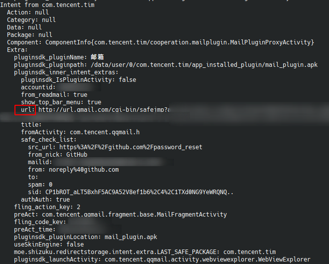

# Riru - InternalBrowserRedirect Rules

Rules for Riru - InternalBrowserRedirect

[中文说明](README_zh.md)


### Rules Repo Structure

```text
/
|--- packages.json
|--- rules
     |--- <package>.json
     |--- <package2>.json
     |--- <package3>.json
     |--- ...json
```

* packages.json - Version and target package of **ALL** rules
* rules directory - All rules save in this directiry
* \<package\>.json - Rule for \<package\>


### File Structure

#### packages.json

```json
{
	"packages": [
		{
			"packageName": "com.tencent.tim",
			"version": 2
		}
	]
}
```

* `packages` - Array for rules
* `packageName` - Target package of rule in `rules` directory 
* `version` - Version of rule in `rules` directory


#### \<package\>.json

```json
{
    "tag": "TIM",
    "authors": "Kr328",
    "rules": [
        {
            "tag": "default",
            "url-source": "intent://extra/url",
            "url-filter": {
                "ignore": ".*qq\\.com/.*",
                "force": ""
            }
        },
        {
            "tag" :"build-in QQ Mail",
            "url-source": "intent://extra/pluginsdk_inner_intent_extras/url",
            "url-filter": {
                "ignore": ".*qq\\.com/.*",
                "force": ""
            }
        }
    ]
}
```

* `tag` - Rule mark that display in controller app

* `authors` - Rules authors (eg. `Kr328, null, ...`)

* `rules` - Rules array

* `url-source`  - Path that extract URL from intent

  `intent://extra/url` actually extract by 

  ```java
  intent.getExtras().get("url").toString();
  ```

  `intent://extra/pluginsdk_inner_intent_extras/url` actually extract by

  ```java
  intent.getExtras().getBundle("pluginsdk_inner_intent_extras").get("url").toString();
  ```

* `url-filter` - URL from intent that be filtered by regex `ignore` and `force`


### Tips for find intent url path

1. Enable Controller App's `Debug Mode`

   **Menu** - **Settings** - **Debug Mode**

2. Install **Android Debug Bridge**

   Google it please

3. Using `adb logcat` 

   ```bash
   adb logcat -s InternalBrowserRedirect -v raw
   ```

4. Reopen **TARGET APPLICATION** 's internal browser 

5. **ALL** Intent structure will print to terminal

   Example

   

   Extract `url` in above image by `intent://extra/pluginsdk_inner_intent_extras/url`
